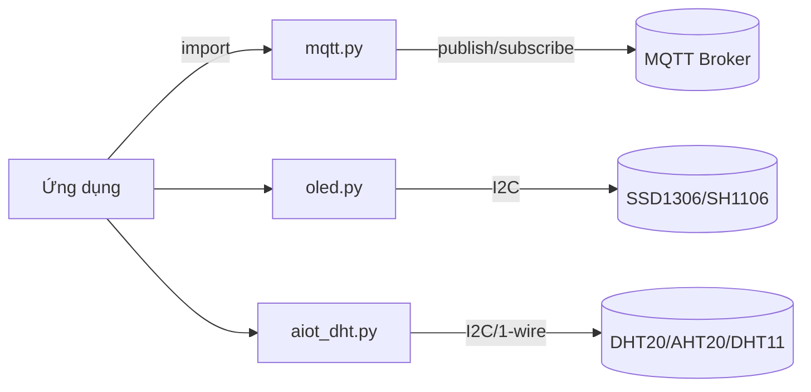

# MicroPython API — ESP32/ESP32‑S3

Tài liệu cho bộ thư viện **MEBLOCK IOT** (MicroPython): **MQTT**, **OLED (SSD1306/SH1106)**, **DHT**.

```mermaid
graph LR
  A[Ứng dụng] -->|import| B[mqtt.py]
  A --> C[oled.py]
  A --> D[aiot_dht.py]
  B -->|publish/subscribe| Broker[(MQTT Broker)]
  C -->|I2C| OLED[(SSD1306/SH1106)]
  D -->|I2C/1-wire| Sensors[(DHT20/AHT20/DHT11)]
```
